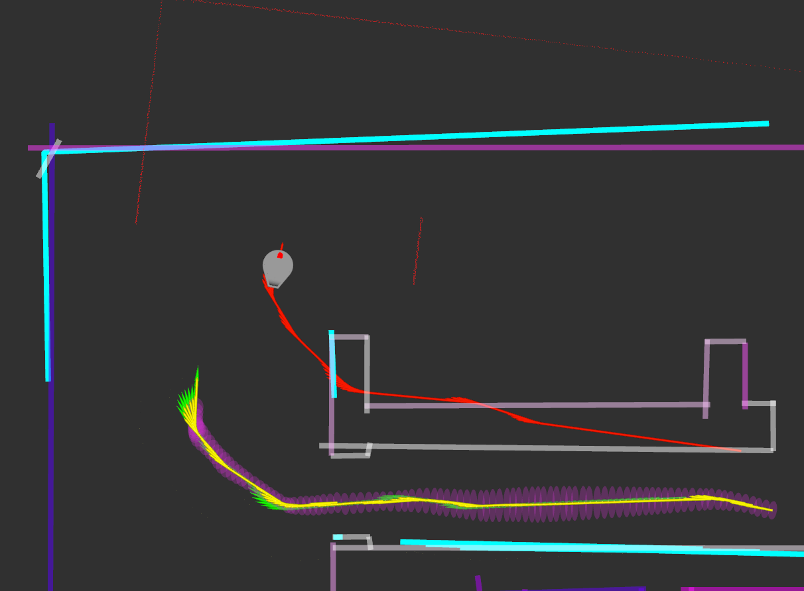

# SCITOS

<div class="columns">
<div>

SCITOS is a course project in IAS0060 Robotics (TalTech). The SCITOS robot is a differencial drive robot that was simulated in Gazebo and RViz enviorments. The goal of the project was to:
- implement mapping algorithm (feature map)
- implement localization algorithm (EKF)
- implement path planning & obstacle avoidance algorithm (RRT)

Here we can see the EKF algorithm (yellow) localizating the robot (green) in a feature map enviorment:

<!--  -->
<p align="center">
  
  <p align="center">SCITOS robot EKF simulation.</figcaption>
</p>

</div>
</div>

## Content

- [SCITOS](#scitos)
  * [Building](#building)
  * [Running](#running)
  * [Save map](#save-map)
  * [Progress documentation](#progress-documentation)


## Building

For building the project use: 
```bash
catkin build
```

To export compile_commands.json use:
```bash
catkin build -DCMAKE_EXPORT_COMPILE_COMMANDS=1
```
_Make sure to copy `compile_commands.json` from under build to project root!_
```bash
# Execute at catkin_ws
jq -s 'map(.[])' build/**/compile_commands.json > ./src/scitos_slam_group_2/compile_commands.json
```

## Running

For running the launch files:

```bash
roslaunch scitos_annus_loomets_kitsing scitos_autonomous.launch

rosrun scitos_annus_loomets_kitsing teleop_key.py  # To drive with keyboard
```

## Save map

After the mapping process is completed use following command to save the map to a .yaml file:

```bash
rostopic pub /save_map std_msgs/String '{"data":"~/catkin_ws/map.yaml"}'
```

## Progress documentation

We used LaTeX to document our differentr analysis for different algorithms and for weekly progress meetings we used slides.

For presenting the weekly slides use:

```bash
marp -s docs
```
