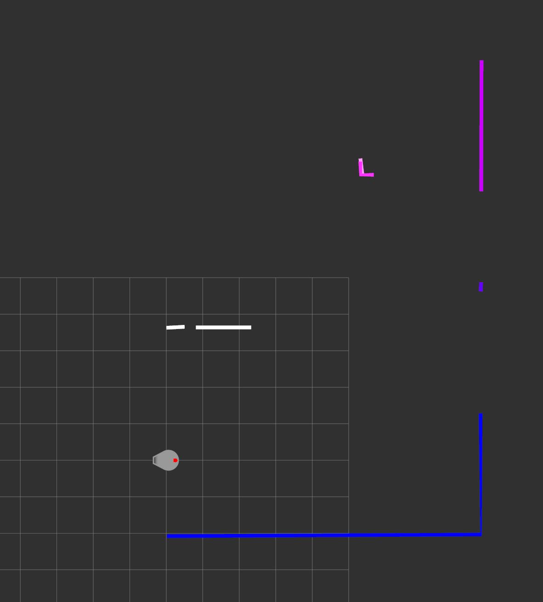

# SCITOS: team 2

Tavo Annus
Timo Loomets
Mattias Kitsing

---

# Tasks

- Decide on how to store map
- Start implementing algorithms

---

# Map choice - EAFC (or inspired by it)
- Did not want grid
- Wanted something that could potentially store topology
- Non-standard, but not too hard to understand

---

# Erosion

- TODO

---

# DBSCAN

- Own imlementation
- Used to distinguish lines from one another
- Can be used for filtering out some noise

---

# DBSCAN

---

# KMeans

- Used for reducing data size
- Maybe drop it and use lines instead of centroids

---

# KMeans

---

# Iterative end point fitting
- Douglas Peucker algorithm

--- 

# Iterative end point fitting

[https://journals.sagepub.com/doi/full/10.5772/59992](https://journals.sagepub.com/doi/full/10.5772/59992)

---

# Iterative end point fitting

---

# TODO
- Merge lines (to store map outside visible range)
- Tweak params
- See what's wrong with odometry (or calculations)
- Benchmark speed

---

