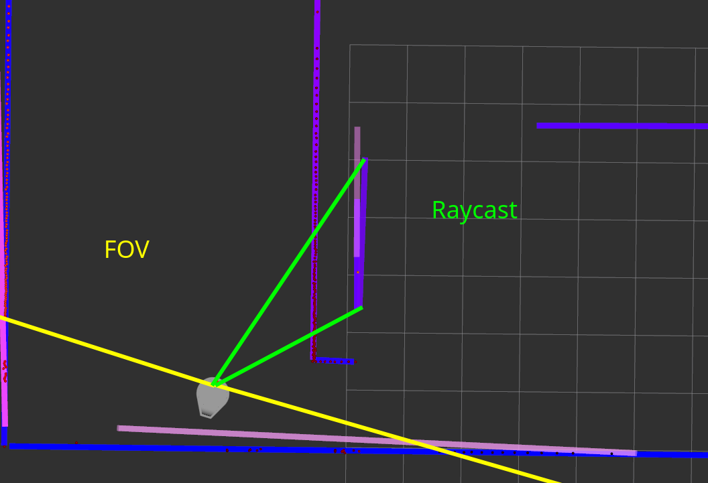
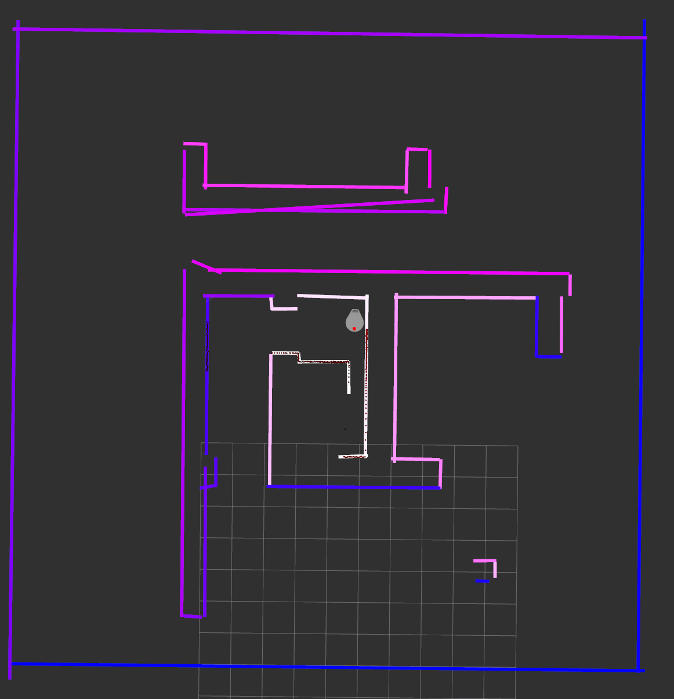

# SCITOS: team 2

Tavo Annus
Timo Loomets
Mattias Kitsing

---

# Tasks

- Research and implement lines merging
- Add confidence to each line
- Tweak parameters

---

# Accumulating map
- Add new lines
- Merge lines on map
- Prune line endings extending too far

---

# Merging lines
- Did not find any good algorithm
- Tried Hough domain - had sme problems
- Used IEPF as inspiration
- Also used linear regression

---

# Merge process

- See if IEPF would split 2 lines if they were merged - if not then merge
- Run regression with confidences and also try to include line length
- Update confidence `p1 + p2 - p1 * p2`
- Use maximal distance of 2 lines combined

---

# Initial confidence

- Count the measured points on line segment
- Divide with segment length
- Can think of it as point cloud density

---

# Pruning lines

---

# Pruning lines

- See if line ends are in FOV
- "Raycast" to both ends to see if they are visible
- If in FOV and visible, trim line end tiny amount
- Repeat every loop

---

# Overall result

---

# Some notes
- Adding lines is easier compared to removing them
- Parallel lines are tricky
- Confinences are hard to get right

---

