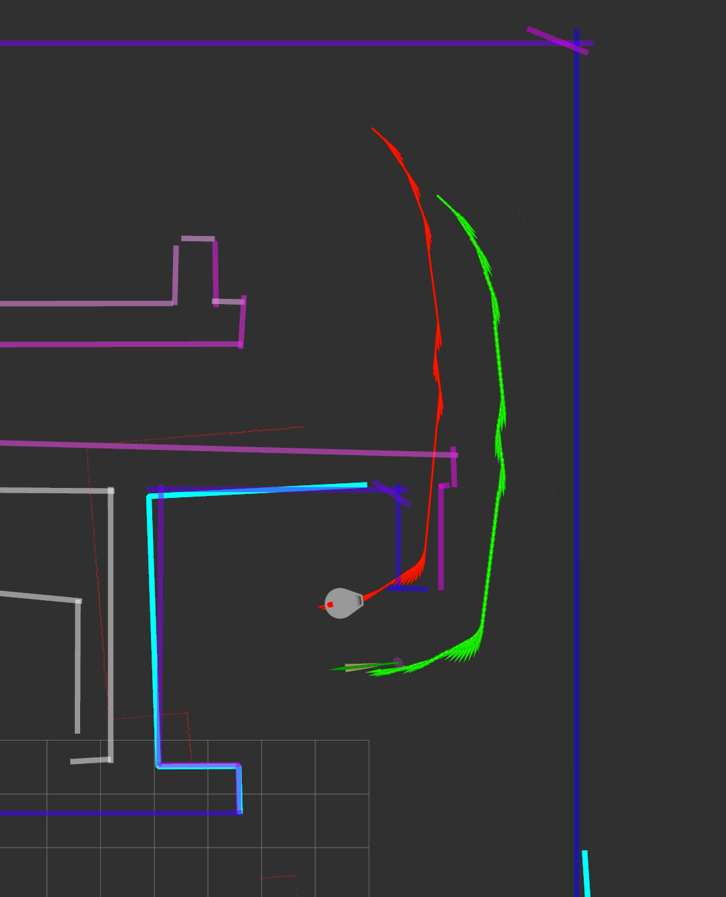

# SCITOS: team 2

Tavo Annus
Timo Loomets
Mattias Kitsing

---

# Tasks

- Fix RViz related issues
- Inprove map loading
- EKF correction step
- _Interpolation still going_

---

# Map loading
- Use `ros::package::getPath(...)`
- Weird compilation (linking) issues
- Now map files can live in `scitos_mapper` package

---

# EKF

- Split to predict and correct
- Predict is called on every `/cmd_vel` msg
- Correct is updated on `/laser_scan` msg

---

# EKF correction
- What is a feature? - Line end point $(r_{p}, \phi_{p}, \psi_{line})$
- How to match features? 
  - Maximal likelyhood
  - Some sanity checks ($\|p - \hat{p}\|_{2}$, $s(l, \hat{l})$)
  - No update if sanity checks fails (better safe than sorry)
  - Needs more checks (visibility etc.)

---

# EKF correction

- Some confusion about $H$ matrix.
  - What to do when $z$ has more elements than rows in $\Sigma$?
  - We had some errors in derivatives which caused nonsense

---

# Problems
- Incorrect feature matches made me doubt in everything
- Lot's of ambiguity how exatly EKF works 
_(what are features, what to pass where, etc.)_
- Interpolation is a must have _(Hopefully ready soon)_

---

# TODO
- Clean up for code
- More sanity checks to feature mapping
- Interpolation/extrapolation
- Update everything to use EKF estimations
- Graphs, statistics
- Tweak params

---

