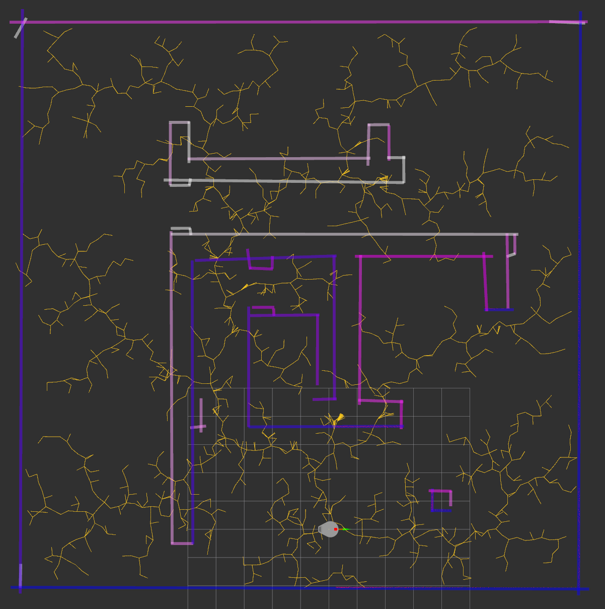
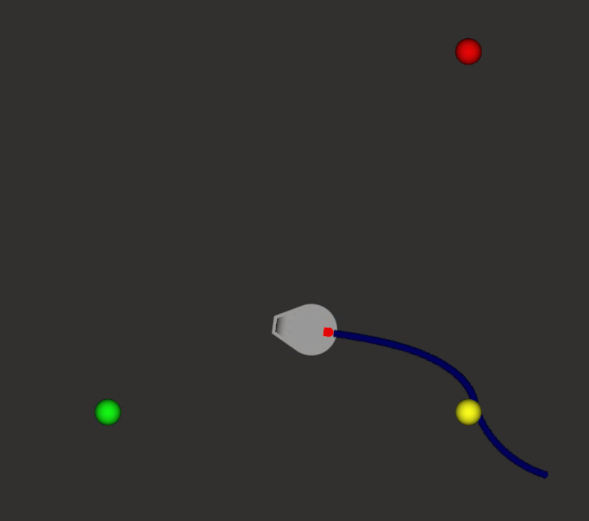

# SCITOS: team 2

Tavo Annus
Timo Loomets
Mattias Kitsing

---

# Tasks

- Make final decision for path planning
- Implement it

---

# Our choice: RRT
- Easy to implement
- Comptutationally faster than RRT*

---

# Implementation
- Basics done
- Wall checks broken
- Pieces are not put together

---
# RRT

---

# Path estimation

- 5 seconds of future
- tracks waypoints
- uses PID

---

# Problems
- Gazebo went crazy on our PID output
- Something wrong with wall checks

---

