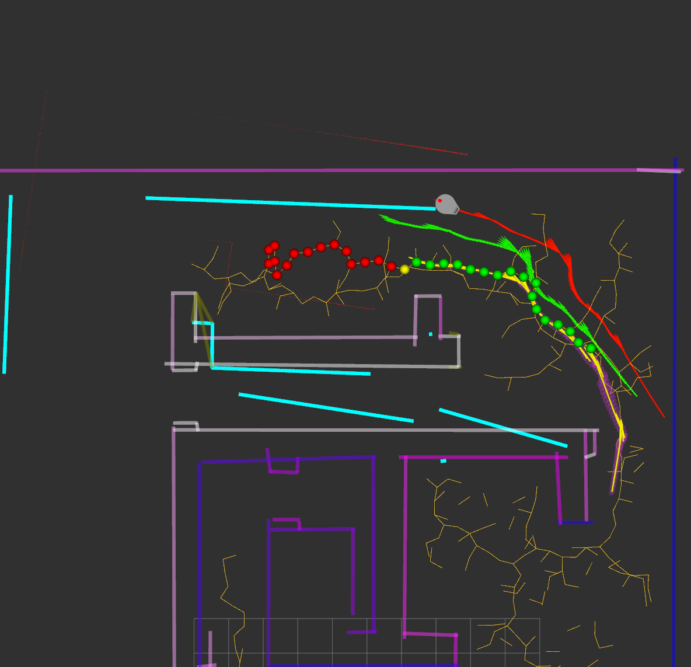

# SCITOS: team 2

Tavo Annus
Timo Loomets
Mattias Kitsing

---

# Tasks

- Finish RRT
- RRT -> actual movement
- Obstacle avoidance

---

# RRT
- Found bug in `project` function
- 20x speedup after fix
- <0.5s for planning

---

# Motion controller
- Use controller from task 1
- Limit angle error when driving
- Funny bugs if angle error is too big

---

# RRT -> path

- Skip nodes if possible
- Always try to last visible node

---

# Path

---

# Obstacle avoidance

- Solved some bugs
- Still not merged

---

# Problems
- Task 1 code could have been more usable :D
- Lack of time

---

