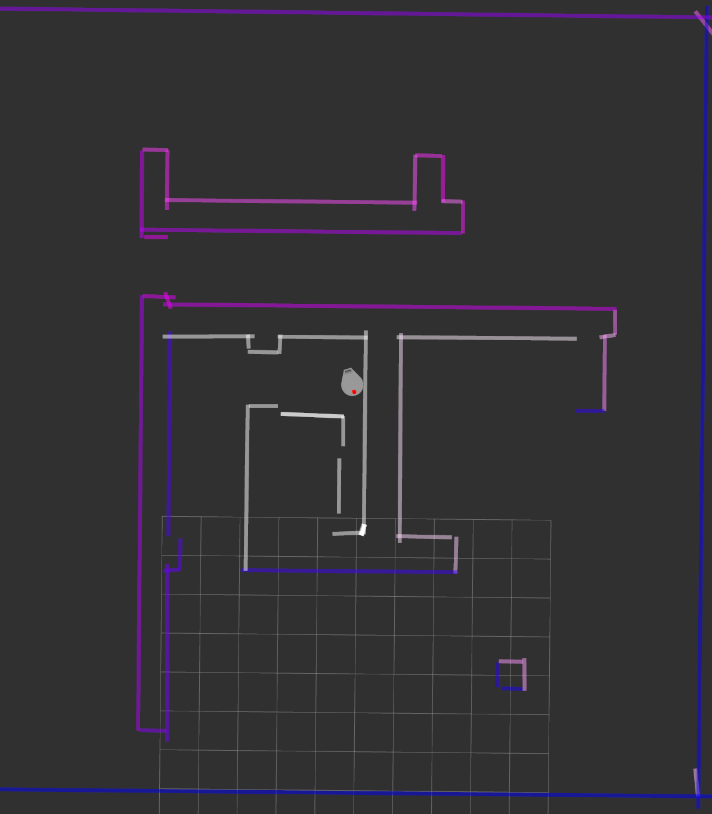

# SCITOS: team 2

Tavo Annus
Timo Loomets
Mattias Kitsing

---

# Tasks

For indoor differential drive robot:
- Choose and implement mapping algorithm
- Choose and implement localization algorithm
- Choose and implement path planning & obstacle avoidance algorithm

---

# Mapping overview

- Feature map (lines as features)
- Line is defined by 2 points
- Roughly inspired by **"Algorithms and a Framework for Indoor Robot Mapping in a Noisy Environment Using Clustering in Spatial and Hough Domains"** _([https://journals.sagepub.com/doi/full/10.5772/59992](https://journals.sagepub.com/doi/full/10.5772/59992))_

---

# Mapping flow 1: Extracting lines

1. Read the laser points
2. Perform noise filtering by eroding and dilating
3. Cluster into objects with DBSCAN
4. Fit lines with IEPF

---

# Mapping flow 2: Accumulating map

1. Find the best match for every line
    - Needs to "overlap"
    - Uses Mahalanobis distance
2. Merge lines that are closer than threshold
3. Add lines that do not have good match
4. Remove lines that have low confidence

---

# Localization 1

---

# Localization 2

---

# Localization 3

---

# Global path planning (RRT)

*RRT graph on map*

*Padding around walls*

---

# Local planning (PID)

*PID errors while driving through waypoints*

---

# Safety (Path simulation)

- Default clamp
- Stricter conditional clamp
- Simulate up to 5s of future
- Stop before potential collision

*Path prediction near walls*

---

# Project conclusion
**The good**
- Good teamwork and impressive result
- Learned interesting new technologies
- Decent project structure

**The bad**
- Solution lacks robustness
- Only unit tests

**The Ugly**
- Technological dept

---
