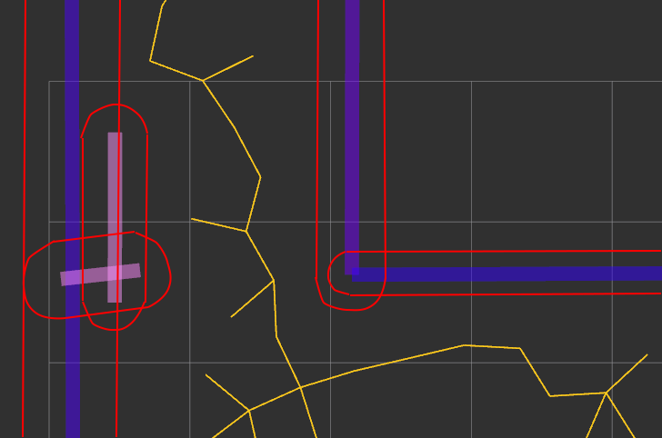

# SCITOS: team 2

Tavo Annus
Timo Loomets
Mattias Kitsing

---

# Mapping 1

---

# Mapping 2

---

# Mapping 3

---

# Localization 1

---

# Localization 2

---

# Localization 3

---

# Global path planning (RRT)

*RRT graph on map*

*Padding around walls*

---

# Local planning (PID)

*PID errors while driving through waypoints*

---

# Safety (Path simulation)

- Default clamp
- Stricter conditional clamp
- Simulate up to 5s of future
- Stop before potential collision

*Path prediction near walls*

---

# Project conclusion
**The good**
- Good teamwork and impressive result
- Learned interesting new technologies
- Decent project structure

**The bad**
- Solution lacks robustness
- Only unit tests

**The Ugly**
- Technological dept

---
