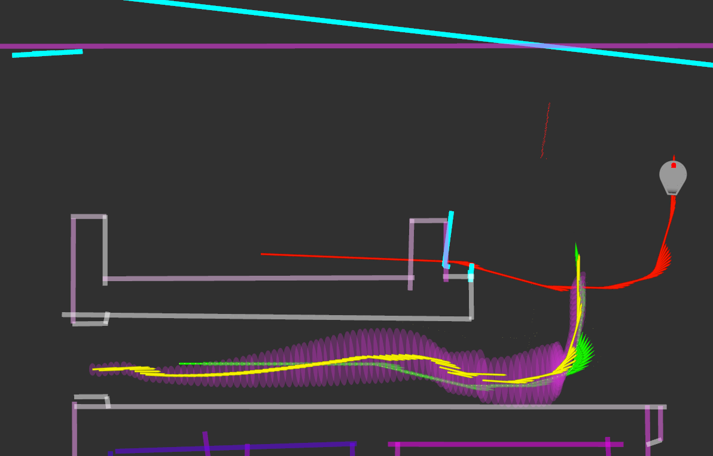
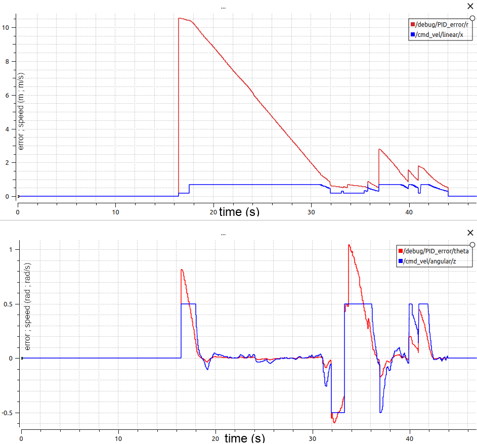

# SCITOS: team 2

Tavo Annus
Timo Loomets
Mattias Kitsing

---

# Tasks

For indoor differential drive robot:
- Choose and implement mapping algorithm
- Choose and implement localization algorithm
- Choose and implement path planning & obstacle avoidance algorithm

---

# Mapping overview

- Feature map (lines as features)
- Line is defined by 2 points
- Roughly inspired by **"Algorithms and a Framework for Indoor Robot Mapping in a Noisy Environment Using Clustering in Spatial and Hough Domains"** _([https://journals.sagepub.com/doi/full/10.5772/59992](https://journals.sagepub.com/doi/full/10.5772/59992))_

---

# Mapping flow 1: Extracting lines
1. Read the laser points
2. Perform noise filtering by eroding and dilating
3. Cluster into objects with DBSCAN
4. Fit lines with IEPF

<!--  -->
<figure>
  
  <figcaption>Fig.1 - Extracted lines.</figcaption>
</figure>

---

# Mapping flow 2: Accumulating map

1. Find the best match for every line
    - Needs to "overlap"
    - Uses Mahalanobis distance
2. Merge lines that are closer than threshold
3. Add lines that do not have good match
4. Remove lines that have low confidence

<!--  -->
<figure>
  
  <figcaption>Fig.2 - Feature map.</figcaption>
</figure>

---

# Localization overview

- EKF algorithm
  - Maximal likelyhood
  - Some sanity checks
  - No update if sanity checks fails
- We used the features from mapping
- Interpolation / Extrapolation

<!--  -->
<figure>
  
  <figcaption>Fig.3 - EKF at work.</figcaption>
</figure>

---

# Localization - EKF results 1

 - Much better resuls than odometry
 - Could recover from uncertanty and errors
 - 

<!--  -->
<figure>
  
  <figcaption>Fig.4 - EKF recovering.</figcaption>
</figure>

---

# Localization - EKF results 2

Had problems with 
- incorrectly mapped features
- long corridors 

<!--  -->
<figure>
  
  <figcaption>Fig.5 - EKF drift.</figcaption>
</figure>

---

# Global path planning (RRT)
<figure>
  
  <figcaption>Fig.6 - RRT graph on map.</figcaption>
</figure>

<figure>
  
  <figcaption>Fig.7 - Padding around walls.</figcaption>
</figure>

<!--
*RRT graph on map*

*Padding around walls*-->

---

# Local planning (PID)
*PID errors while driving through waypoints*

<!--  -->

<figure>
  
  <figcaption>Fig.7 - PID errors.</figcaption>
</figure>

---

# Safety (Path simulation)

- Default clamp
- Stricter conditional clamp
- Simulate up to 5s of future
- Stop before potential collision
*Path prediction near walls*

<!--  -->

<figure>
  
  <figcaption>Fig.8 - Path prediction.</figcaption>
</figure>

---

# Project conclusion
**The good**
- Good teamwork and impressive result
- Learned interesting new technologies
- Decent project structure

**The bad**
- Solution lacks robustness
- Only unit tests

**The Ugly**
- Technological dept

---
